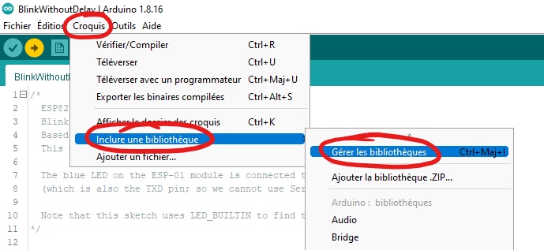
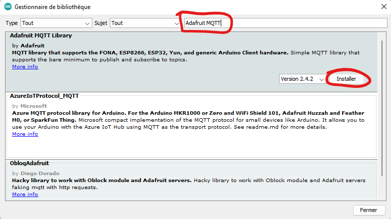
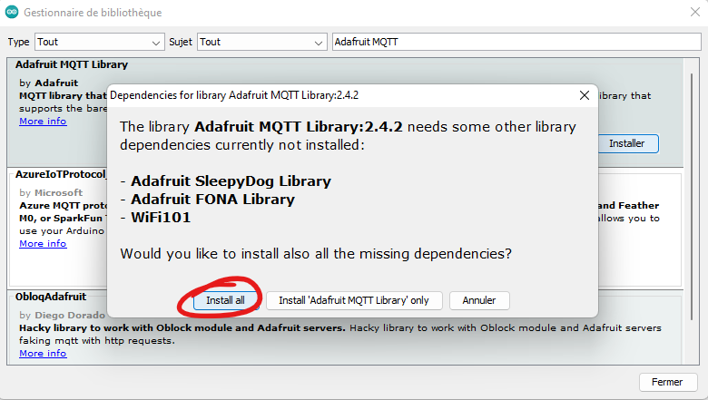

# Installer la librairie Adafruit MQTT

- Pour ouvrir le gestionnaire de librairies, allez dans le menu `Croquis > Inclure une bibliothèque > Gérer les bibliothèques`.

  

- Pour installer la librairie, recherchez `Adafruit MQTT` <kbd>Enter</kbd> dans le champs texte de recherche puis cliquez sur le bouton `Installer`

  

- Pour installer les dépendances de la librairie, cliquez sur le bouton `Install all` dans la fenêtre popup.

  