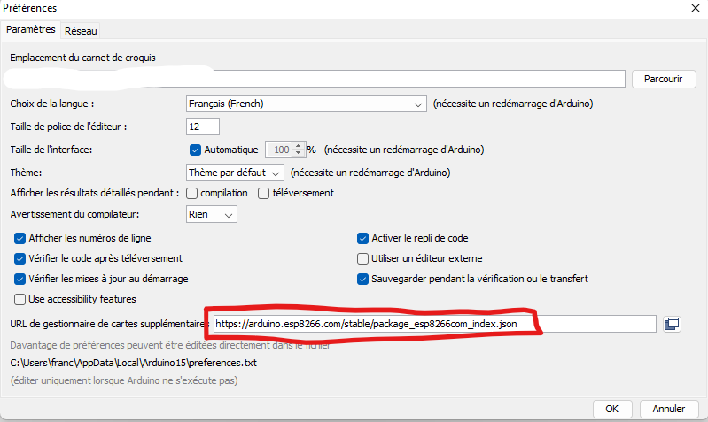
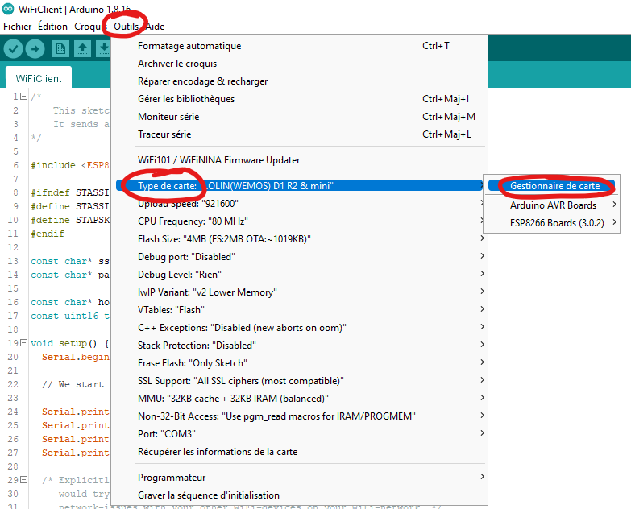
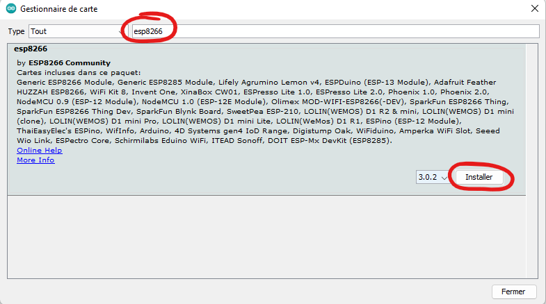

# Ajouter le gestionnaire de carte ESP8266 dans Arduino

- Pour ajouter une URL de gestionnaire de cartes supplémentaires, allez dans le menu `Fichier > Préférences` et collez l'URL ci-dessous dans le champ texte `URL de gestionnaire de cartes supplémentaires` puis cliquez sur `OK`.
  ```
  https://arduino.esp8266.com/stable/package_esp8266com_index.json
  ```
  
- Pour ouvrir le gestionnaire de cartes, allez dans le menu `Outils > Type de carte > Gestionnaire de carte`.
  
- Pour installer le gestionnaire de cartes, recherchez `esp8266` <kbd>Enter</kbd> dans le champs texte de recherche puis cliquez sur le bouton `Installer`. Si le bouton `Installer` n'apparaît pas, cliquez n'importe où dans le cadre de la description.
  