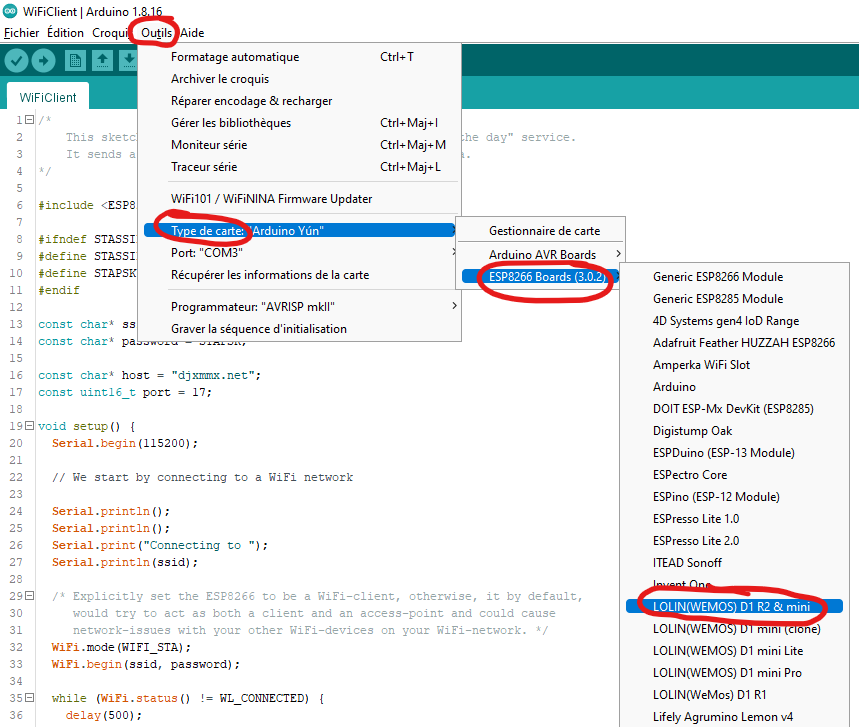
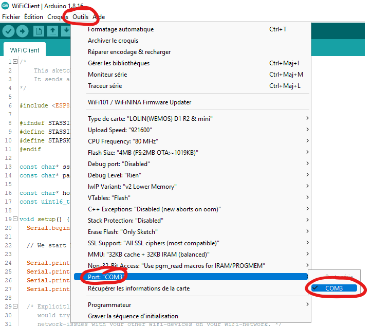

# Sélectionner la carte ESP8266 dans Arduino

- Assurez-vous d'avoir [installé le gestionnaire de cartes](arduino_esp8266_board_manager.md).
- Pour sélectionner la carte ESP8266, allez dans le menu `Outils > Type de carte > ESP8266 Boards (...)` et sélectionnez `LOLIN(WEMOS) D1 R2 & mini`.

  

- Pour sélectionner le port de communication, allez dans le menu `Outils > Port: "..."` et sélectionnez `

  